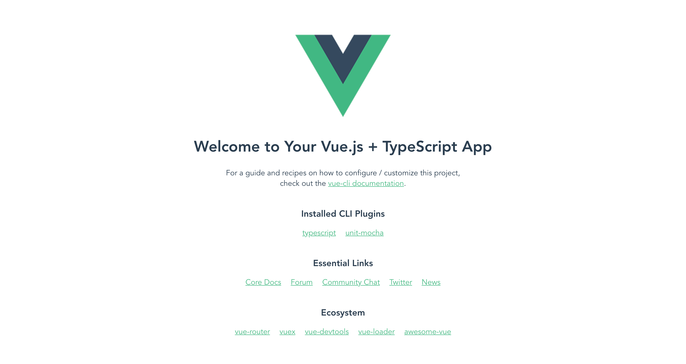

# 概要

Vueの開発環境

# インストール

```
npm install -g @vue/cli
vue --version
```

# プロジェクト作成

```
vue create 1503-vuecliexample
```

大文字、_は使用できない。

```
? Please pick a preset: (Use arrow keys)
❯ template (typescript, unit-mocha) 
  presettest (typescript, unit-mocha) 
  default (babel, eslint) 
  Manually select features 
```

カーソルでプリセットの選択切り替え、エンターで選択  
Manually select features を選択

```
? Please pick a preset: Manually select features
? Check the features needed for your project: 
 ◯ Babel
 ◉ TypeScript
 ◯ Progressive Web App (PWA) Support
 ◯ Router
 ◯ Vuex
 ◯ CSS Pre-processors
 ◉ Linter / Formatter
❯◉ Unit Testing
 ◯ E2E Testing
```

スペースで必要な機能をトグル選択  
TypeScript, Linter / Formatter, Unit Testing を選択

```
? Please pick a preset: Manually select features
? Check the features needed for your project: TS, Linter, Unit
? Use class-style component syntax? (Y/n) n
```

クラススタイルコンポーネントを使用するか  
nを選択(TypeScript*Vueでclass-style componentは現在バグがある)

```
? Please pick a preset: Manually select features
? Check the features needed for your project: TS, Linter, Unit
? Use class-style component syntax? No
? Use Babel alongside TypeScript for auto-detected polyfills? (y/N) N
```

TypeScriptとBabelを同時に使用するか？ → N

```
? Please pick a preset: Manually select features
? Check the features needed for your project: TS, Linter, Unit
? Use class-style component syntax? No
? Use Babel alongside TypeScript for auto-detected polyfills? No
? Pick a linter / formatter config: 
❯ TSLint 
  ESLint with error prevention only 
  ESLint + Airbnb config 
  ESLint + Standard config 
  ESLint + Prettier 
```

linter formatter の選択。TSLintを選択（後で微調整する）

```
? Pick additional lint features: 
 ◉ Lint on save
❯◯ Lint and fix on commit
```

保存時にLint  
コミット時にLintと自動修正

```
? Pick a unit testing solution: 
❯ Mocha + Chai 
  Jest 
```

ユニットテストに何を使用するか

```
? Where do you prefer placing config for Babel, PostCSS, ESLint, etc.? 
❯ In dedicated config files 
  In package.json 
```

各種設定にコンフィグファイルを用意するかpackage.jsonに埋め込むか

```
? Please pick a preset: Manually select features
? Check the features needed for your project: TS, Linter, Unit
? Use class-style component syntax? No
? Use Babel alongside TypeScript for auto-detected polyfills? No
? Pick a linter / formatter config: TSLint
? Pick additional lint features: Lint on save
? Pick a unit testing solution: Mocha
? Where do you prefer placing config for Babel, PostCSS, ESLint, etc.? In dedicated config files
? Save this as a preset for future projects? (y/N) ? Save this as a preset for future projects? (y/N) 
```

ここまでの設定をプリセットとして保存するか（次回呼び出せるようになる）

```
🎉  Successfully created project 1503-vuecliexample.
👉  Get started with the following commands:

 $ cd 1503-vuecliexample
 $ npm run serve
```

と表示されたら成功。

```
cd 1503-vuecliexample
npm run serve
```

で実行確認。表示されたURL http://localhost:8080/  にアクセス。




## VueCLIで作成したプロジェクトを自分のプロジェクトに合わせる

### Vueの設定ファイル作成

https://cli.vuejs.org/config/#vue-config-js  
vue.config.jsを作成して設定を切り替える。以下はデフォルト構成。

``` js
module.exports = {
  pages: {
    index: {
      // 最初に実行されるファイル名
      entry: 'src/main.ts',
      // テンプレートファイル
      template: 'public/index.html',
      // 出力されるファイル名
      filename: 'index.html',
      // タイトル
      // <title><%= htmlWebpackPlugin.options.title %></title>
      title: 'title',
      // チャンクの指定
      chunks: ['chunk-vendors', 'chunk-common', 'index']
    },
    // /sub.html にアクセスするとこちらが呼ばれるようになる
    // sub: 'src/main2.ts'
  },
  // キャッシュバスティングのためにファイル名にハッシュをつけている。
  // デフォルトでtrueなので、falseの場合のみ指定
  // filenameHashing: true,
  // // ポートなどの設定
  // devServer: {
  //   port: 5000,
  //   contentBase: path.resolve(__dirname, 'public'),
  //   host: 'localhost',
  // },
  // css: {
  //   // 毎回読み込んでおくscssファイルの指定
  //   loaderOptions: {
  //     sass: {
  //       data: `@import "@/val.scss";`
  //     }
  //   }
  // },
  // configureWebpack: {
  //   module: {
  //     rules: [
  //       {
  //         test: /\.js$/,
  //         loader: 'babel-loader',
  //         exclude: /node_modules/,
  //       },
  //     ]
  //   },
  //   resolve: {
  //     alias: {
  //       'vue$': 'vue/dist/vue.esm.js',
  //       '@': path.resolve(__dirname, 'src/'),
  //     }
  //   },
  //   plugins: [
  //     // plugin
  //   ]
  // }
}

```

### 単純化する

デフォルトだとまだ複雑なので単純化する。  

#### App.vue 書き換え

``` html
<template>
  <div id="app">
    <h1>Hello VueCLI</h1>
  </div>
</template>
```

#### main.ts 書き換え

``` ts
import Vue from 'vue';
import App from './App.vue';

Vue.config.productionTip = false;

new Vue({
  render: (h) => h(App),
}).$mount('#app');
```

保存すると画面が自動更新される。  
parts/HelloWorld.vue は削除。  

#### tslint書き換え  

09_Lintに準ずるようにtslint.configを書き換える。  

```
  "rules": {
    "curly": true,
    "semicolon": [
      true,
      "never"
    ],
    "object-literal-sort-keys": false,
    "no-var-requires": false,
    "object-literal-shorthand": false,
    "member-ordering": [
      false
    ],
    "no-string-literal": false,
    "interface-over-type-literal": false,
    "no-console": [
      false
    ],
    "no-reference": false,
    "max-classes-per-file": [
      false,
      1
    ],
    "prefer-conditional-expression": false,
    "no-bitwise": false,
    "one-line": false,
    "no-consecutive-blank-lines": false,
    "interface-name": false
  }
```

エラーが出るようになるので書き換える。

- セミコロン削除
- '' → ""

サーバ起動中の場合Ctrl+Cで中断したあと改めて```npm run serve```  

上記手順で作成したソースは1503_VueCLI以下を参照。

# 参考

https://cli.vuejs.org/

