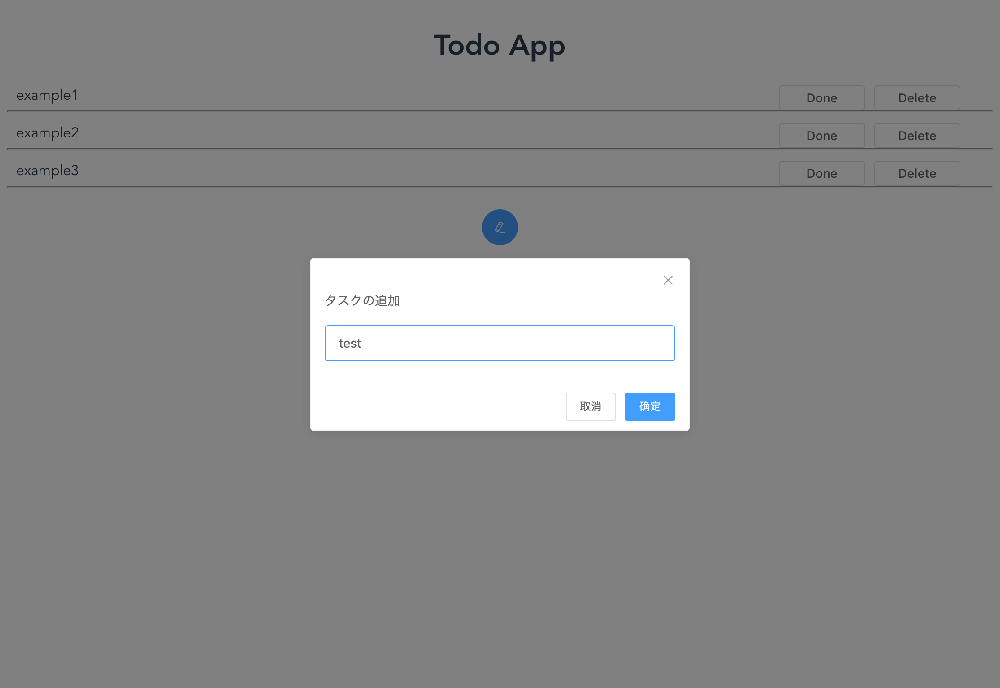

# 確認

```
cd 18_Express/1802_TodoApp/
```

## ビルド

```
npm run build:prod
```

## サーバ起動

```
npm start
```

http://localhost:3000 へアクセス


# 開発手順

## 仕様を考える

- TODOの追加、変更、削除ができるようにする
- TODOはとりあえずテキストで保持するようにする

---
## モックアップを作成する

``` html
<template>
  <div id="app">
    <h1>Todo App</h1>
    <ul>
      <li v-for="datum in data" :key="datum.id">
        <el-row>
          <el-col :span="18">
            <div class="todo_content">
              <span>{{ datum.text }}</span>
            </div>
          </el-col>
          <el-col :span="6">
            <el-button>Done</el-button>
            <el-button>Delete</el-button>
          </el-col>
          <hr>
        </el-row>
      </li>
    </ul>
    <el-button type="primary" icon="el-icon-edit" circle @click="addTask"></el-button>
  </div>
</template>

<script lang="ts">
import Vue from "vue"
interface DataModel {
  /** 全体で一意 */
  id: number,
  text: string,
  /** false:未完了 true:完了 */
  completed: boolean,
}
export default Vue.extend({
  name: "app",
  data() {
    return {
      data: [
        { id: 0, text: "example1", completed: false },
        { id: 1, text: "example2", completed: false },
        { id: 2, text: "example3", completed: false },
      ] as DataModel[],
    }
  },
  methods: {
    addTask() {
      this.$prompt("タスクの追加", {
        callback: (action) => {
          // TODO:タスク追加処理
        },
      })
    },
  },
})
</script>

<style>
#app {
  font-family: "Avenir", Helvetica, Arial, sans-serif;
  -webkit-font-smoothing: antialiased;
  -moz-osx-font-smoothing: grayscale;
  text-align: center;
  color: #2c3e50;
  /* margin-top: 60px; */
}

ul {
  padding-left: 0;
}

li {
  list-style-type: none;
  margin-top: 0.25rem;
  margin-bottom: 0.25rem;
}

li span {
  padding: 10px;
}

li .el-button {
  padding: 6px 4px;
  width: 6rem;
}

.todo_content {
  text-align: left;
}
</style>
```

ざっくり以下のようになる。



---
## ローカルで動作するように作り込む

### TODOを追加する

``` ts

export default Vue.extend({
// ...
  data() {
    return {
      tasks: [
      ] as DataModel[],

      maxID: 0,
    }
  },
  methods: {
    addTask() {
      this.$prompt("タスクの追加", {
        callback: (action, instance) => {
          if (action === "confirm" && instance.inputValue) {
            this.tasks.push({
              id: this.maxID,
              text: instance.inputValue,
              completed: false,
            })
            this.maxID++
        },
      })
    },
  },
})
```

dataをtasksにリネーム。 　
プロンプト画面の戻り値を元にタスクへ追加。 　
固定で指定していたdataの中身は削除する。 　

### Todoを削除、完了できるようにする

``` html
<el-button @click="done(task.id)">Done</el-button>
<el-button @click="remove(task.id)">Delete</el-button>
```

``` ts
done(taskID: number) {
  for (let i = 0; i < this.tasks.length; i++) {
    if (this.tasks[i].id === taskID) {
      this.tasks.splice(i, 1)
    }
  }
},
remove(taskID: number) {
  for (let i = 0; i < this.tasks.length; i++) {
    if (this.tasks[i].id === taskID) {
      this.tasks.splice(i, 1)
    }
  }
},
```

---
## サーバ側を作り込む(保存機能を作成する)

app.jsを開いてフォーカスをあててF5を押すことでデバッグできる。 　

### 仕様

- タスクはテキストで管理する
- 追加したタイミングでテキストに保存する
- 削除したタイミングでテキストから削除する
- 完了した場合別途完了ずみのテキストファイルへ移動する

---
### サーバとクライアントがやり取りするためのガワを作成する

#### サーバ

``` js
app.route('/task')
  // タスク一覧を取得する
  .get(function (req, res) {
    // TODO
    res.send('Get tasks');
  })
  // タスクを追加する
  .post(function (req, res) {
    // TODO
    res.send('Add task');
  })
  // タスクを更新する
  .put(function (req, res) {
    // TODO
    res.send('Update task');
  })
  // タスクを削除する
  .delete(function (req, res) {
    // TODO
    res.send('Delete task');
  })

```

/task にhttpリクエストを送信した時に処理を行う（予定）

#### クライアント

``` ts
  mounted() {
    axios({
      method: "get",
      url: "/task",
    }).then((response) => {
      console.log(response.data)
    })
  },
  ```

  マウント時にタスク一覧を取得する

  ``` ts
  axios({
    method: "post",
    url: "/task",
    headers: {
      "Content-Type": "application/json",
    },
    data: {
      src: {},
    },
  }).then((response) => {
    console.log(response.data)
  })
  ```
  methodに"post", "put", "delete"を指定して処理を切り替える

axiosを使用するために
index.html へ

``` html
<script src="https://unpkg.com/axios/dist/axios.min.js"></script>
```

を追記して

vue.config.js へ

``` js
config.externals({
  "axios": "axios",
  // ...
})
```

を追記する。

---
### 中身を作り込んでいく

#### タスク追加処理

サーバ

``` js
  .post(function (req, res) {
    // console.log(req.body);
    const task = req.body.src
    const data = task.id + "\t" + task.text + "\t" + task.completed + "\n"

    const directory = "data"
    fs.mkdir(directory, function (err) {
      fs.appendFile(directory + "/task.tsv", data, function (err) {
        if (err) {
          throw err;
        }
      });
    });

    res.send('Add task');
  })
```

フロント

``` ts
const task = {
  id: this.maxID,
  text: instance.inputValue,
  completed: false,
}
this.tasks.push(task)
this.maxID++

axios({
  method: "post",
  url: "/task",
  headers: {
    "Content-Type": "application/json",
  },
  data: {
    src: task,
  },
}).then((response) => {
  console.log(response.data)
})
```

#### タスク読み込み処理

サーバ

``` js

  // タスク一覧を取得する
  .get(function (req, res) {
    // TODO
    fs.readFile("data/task.tsv", 'utf8', function (err, data) {

      const tasks = []
      if (!err) {
        const list = data.split("\n")
        list.forEach((line) => {
          const task = line.split("\t")
          if (task.length === 3) {
            tasks.push({
              id: task[0],
              text: task[1],
              completed: task[2],
            })
          }
        })
      }

      res.send(tasks);
    });
  })
```

フロント

``` ts
  mounted() {
    axios({
      method: "get",
      url: "/task",
    }).then((response) => {
      response.data.forEach((datum: DataModel) => {
        this.tasks.push(datum)
      })
      this.maxID = this.tasks[this.tasks.length - 1].id + 1
    })
  },
```


#### タスク削除処理

サーバー

``` js
  // タスクを削除する
  .delete(function (req, res) {
    const taskID = req.body.taskid
    fs.readFile("data/task.tsv", 'utf8', function (err, readedData) {

      const tasks = ""
      if (!err) {
        const list = readedData.split("\n")
        list.forEach((line) => {
          const task = line.split("\t")
          if (task.length === 3 && task[0] !== taskID) {
            tasks += line + "\n"
          }

        })
        fs.writeFile("data/task.tsv", tasks, function (err) {
          res.send("Deleted.");
        })
      }

    });
  })
```

フロント

``` ts
    remove(taskID: number) {
      for (let i = 0; i < this.tasks.length; i++) {
        if (this.tasks[i].id === taskID) {
          this.tasks.splice(i, 1)
          axios({
            method: "delete",
            url: "/task",
            data: {
              taskid: taskID,
            },
          }).then((response) => {
            console.log(response.data)
          })
          break
        }
      }
    },
```

#### タスク完了処理

``` js
  // タスクを更新する
  .put(function (req, res) {
    const task = req.body.task

    fs.appendFile(directory + "/done.tsv", `${task.id}\t${task.text}\t${task.completed}\n`, function (err) {
      if (err) {
        console.log(err);
      }
    });

    fs.readFile("data/task.tsv", 'utf8', function (err, readedData) {

      const tasks = ""
      if (!err) {
        const list = readedData.split("\n")
        list.forEach((line) => {
          const task = line.split("\t")
          if (task.length === 3 && task[0] !== taskID) {
            tasks += line + "\n"
          }

        })
        fs.writeFile("data/task.tsv", tasks, function (err) {
          res.send("Deleted.");
        })
      }

    });
  })
```

# やってみる

- タスクに着手しているのがわかるようにしたい
- タスクを並べ替えたい
- テキストに保存しているタスクをDBに保存するようにする
- タスクを編集できるようにしたい
- 現状アプリケーション一つでタスクを共用しているので分けられるようにする
- 通信時エラーが発生した時の処理を追加する(取得失敗、追加失敗,etc...)
- 完了済みのタスクを画面から確認できるようにする

# 参考

https://vuejs.org/v2/examples/todomvc.html
